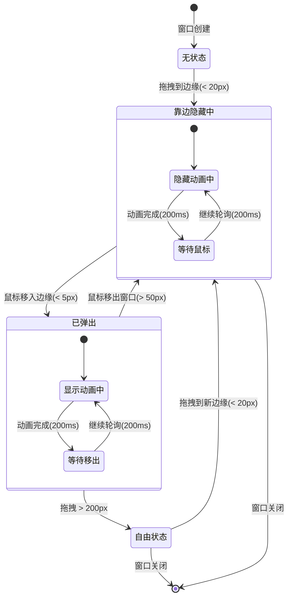
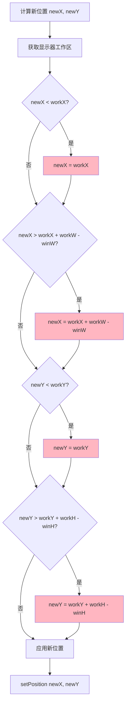
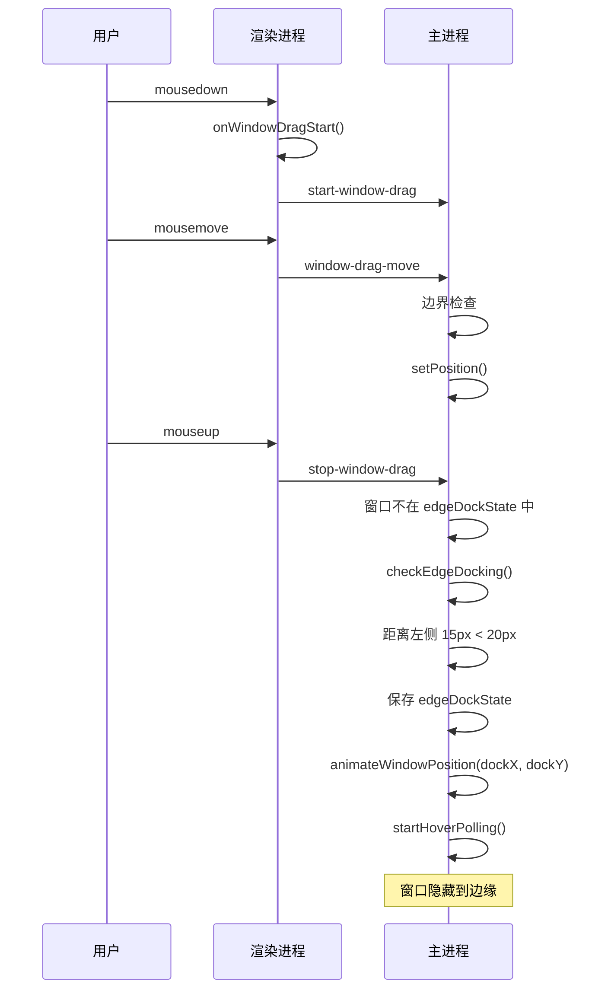
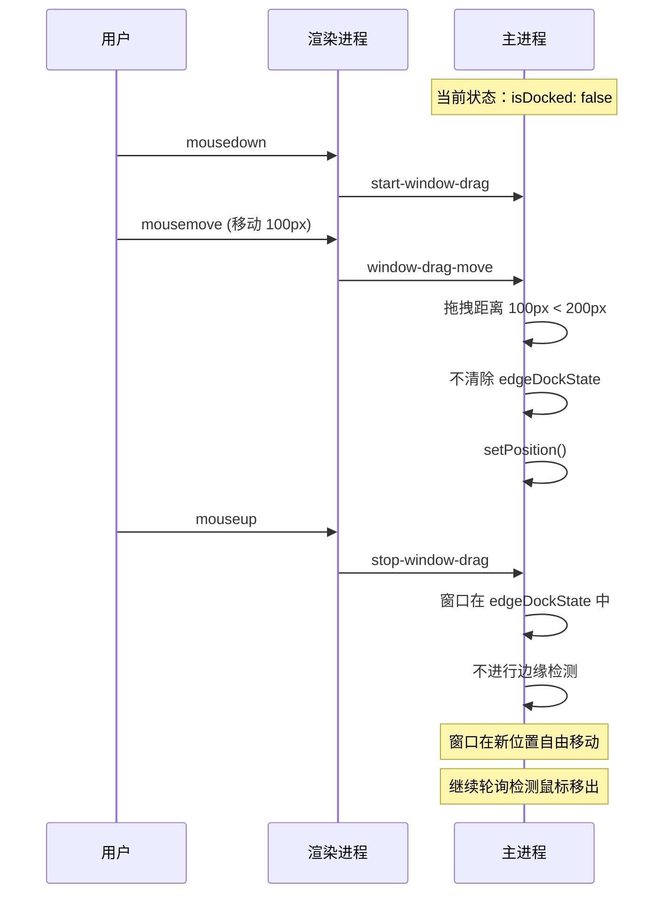
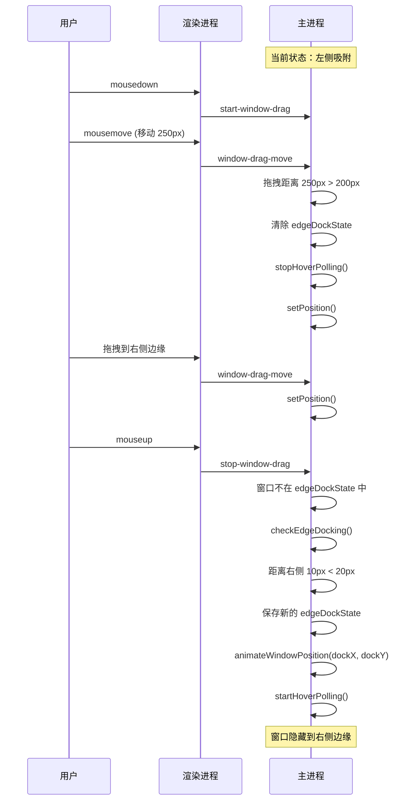

# 靠边吸附交互流程图

## 状态转换图



## 拖拽交互流程

```mermaid
flowchart TD
    A[用户开始拖拽] --> B{移动距离 > 3px?}
    B -->|否| A
    B -->|是| C[启动 IPC 拖拽]

    C --> D[window-drag-move]
    D --> E{移动距离 > 200px?}
    E -->|是| F[清除 edgeDockState]
    E -->|否| G[保持 edgeDockState]
    F --> H[更新窗口位置]
    G --> H

    H --> I[用户释放鼠标]
    I --> J{窗口在 edgeDockState 中?}

    J -->|是| K[不进行边缘检测]
    J -->|否| L{checkEdgeDocking}

    L -->|距离边缘 < 20px| M[保存 edgeDockState]
    L -->|距离边缘 >= 20px| N[结束]

    M --> O[动画移动到靠边位置]
    O --> P[启动鼠标轮询]

    K --> N
    N --> [*]

    style K fill:#90EE90
    style M fill:#FFE4B5
```

## 鼠标轮询流程

```mermaid
flowchart TD
    A[轮询开始] --> B{floatWindow 存在?}
    B -->|否| C[停止轮询]
    B -->|是| D{edgeDockState 存在?}

    D -->|否| C
    D -->|是| E[获取鼠标位置]

    E --> F{state.isDocked?}

    F -->|true| G{鼠标在边缘附近?<br/>(< 5px)}
    F -->|false| H{鼠标远离窗口?<br/>(> 50px)}

    G -->|是| I[动画弹出到原始位置]
    G -->|否| J[继续轮询]

    H -->|是| K[动画收起到靠边位置]
    H -->|否| J

    I --> L[更新 state.isDocked = false]
    K --> M[更新 state.isDocked = true]

    L --> J
    M --> J

    J --> A

    style G fill:#90EE90
    style H fill:#FFE4B5
```

## 边界检查流程



## 时序图：首次吸附



## 时序图：拖拽弹出的窗口



## 时序图：重新吸附到新边缘



## 阈值示意图

```
屏幕宽度: 1920px
工作区: 1920px - 任务栏高度

左侧边缘:
  0px                    20px         工作区宽度
  |                       |            |
  |  窗口左边缘检测区域  |            |
  |<---- EDGE_THRESHOLD --->|
  |                       |            |

鼠标移入检测:
  窗口右边缘    5px内触发弹出
  |             |
  |<----------->|

鼠标移出检测:
  窗口右边缘              50px外触发收起
  |                       |
  |<--------------------->|

拖拽清除阈值:
  起始位置                       200px
  |                              |
  |<--------------------------->|
```

## 关键参数

| 参数 | 值 | 单位 | 说明 |
|------|-----|------|------|
| `EDGE_THRESHOLD` | 20 | px | 触发吸附的距离阈值 |
| `EDGE_REVEAL_ZONE` | 5 | px | 触发弹出的距离阈值 |
| `EDGE_HIDE_ZONE` | 50 | px | 触发收起的距离阈值 |
| `CLEAR_DOCK_THRESHOLD` | 200 | px | 清除吸附状态的拖拽距离 |
| `DRAG_THRESHOLD` | 3 | px | 启动拖拽的最小移动距离 |
| 动画时长 | 200 | ms | 弹出/收起动画的持续时间 |
| 轮询间隔 | 200 | ms | 鼠标位置检测的间隔 |
